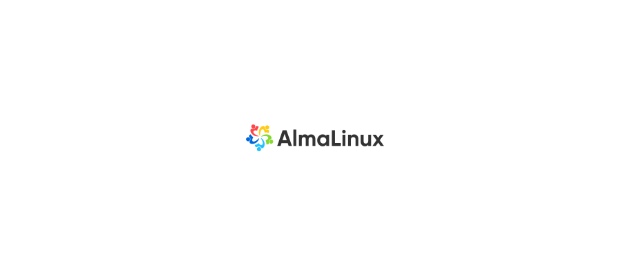

<p align="center"><a href="#readme"></a></p>

<p align="center">
  <a href="https://kaos.sh/w/almalinux/cd"></a>
  <a href="#license"></a>
</p>

<p align="center"><a href="#usage">Usage</a> • <a href="#contributing">Contributing</a> • <a href="#license">License</a></p>

<br/>

This repository contains Dockerfiles for [Alma Linux](https://almalinux.org) 8, 9 and 10 for automatic image rebuild with the latest packages installed. The resulting images are usually bigger than base images but more secure (_due to the very long period between base images rebuild_).

### Usage

Using DockerHub:

```bash
docker pull essentialkaos/almalinux:8
docker pull essentialkaos/almalinux:9
docker pull essentialkaos/almalinux:10
```

Using GitHub Container Registry:

```bash
docker pull ghcr.io/essentialkaos/almalinux:8
docker pull ghcr.io/essentialkaos/almalinux:9
docker pull ghcr.io/essentialkaos/almalinux:10
```

### Contributing

Before contributing to this project please read our [Contributing Guidelines](https://github.com/essentialkaos/contributing-guidelines#contributing-guidelines).

### License

[Apache License, Version 2.0](http://www.apache.org/licenses/LICENSE-2.0)

<p align="center"><a href="https://essentialkaos.com"></a></p>
